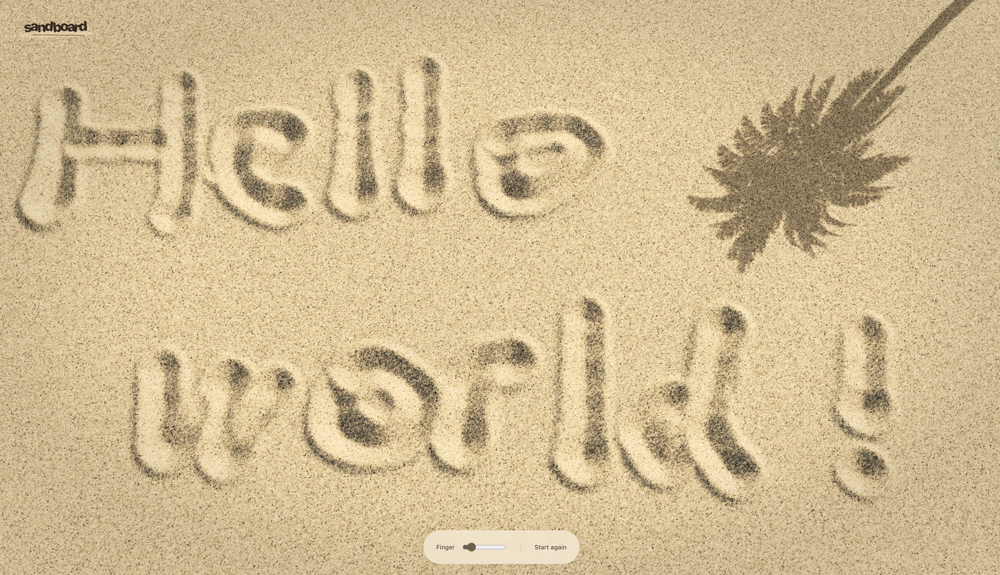

# Sandboard

There is something oddly satisfying about dragging a finger through a perfectly smooth patch of sand and immediately ruining it in the best possible way.

***Play Live at: https://sand.scottsun.io***

Sandboard is built around that feeling. Start with a quiet, untouched surface, draw a line, carve a shape, scribble too fast, use two hands, make a mess, then smooth everything away and start again.

The sand is meant to feel playful rather than precious. Slow movements leave deliberate marks. Fast ones kick things up. A tiny gesture can become a neat little groove; a reckless swipe can turn into a miniature landslide.

On a phone or tablet, several fingers can join in at once, which makes Sandboard less like a drawing tool and more like a small patch of beach that happens to live under glass.

There is no score, no objective, and no correct thing to make. The whole point is the moment between a clean surface and whatever you decide to do to it next.

## License

This project is licensed under the GNU General Public License v3.0 (GPL-3.0-only).

You may use, modify, and redistribute this software under the terms of the GPLv3. If you distribute a modified or derivative version of this project, you must also make the corresponding source code available under the GPLv3.

See the [LICENSE](./LICENSE) file for the full license terms.
